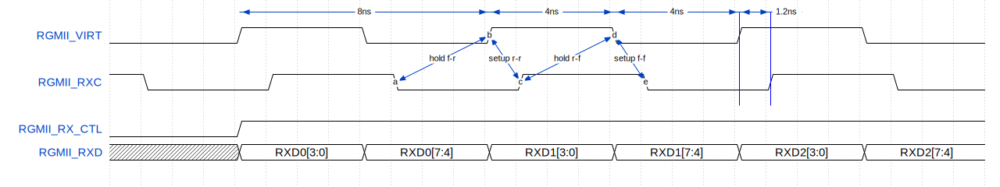
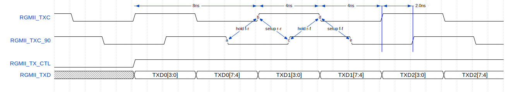

# SDC constraint example for the KSZ9031 in default mode. Access to MDIO registers is not performed after a reset. All MDIO registers are in default state.

The KSZ9031 chip's RGMII TX interface requires a default 2 ns (90-degree) shift for the TXC clock. To achieve this, two 125 MHz clocks must be generated, with one shifted by 90 degrees using either a PLL or a delay line. Generate the clock signals CLK_125MHZ and CLK_125MHZ_90 (a copy of CLK_125MHZ phase-shifted by 90 degrees) based on the reference signal CLK_100MHZ supplied by the board:
```
create_clock -period 10.000 -name CLK_100MHZ -waveform {0.000 5.000} [get_ports CLK_100MHZ]

create_generated_clock -name CLK_125MHZ    -source [get_pins Sys_Clk_PLL_inst/inst/mmcm_adv_inst/CLKIN1] -master_clock [get_clocks CLK_100MHZ] [get_pins Sys_Clk_PLL_inst/inst/mmcm_adv_inst/CLKOUT0]
create_generated_clock -name CLK_125MHZ_90 -source [get_pins Sys_Clk_PLL_inst/inst/mmcm_adv_inst/CLKIN1] -master_clock [get_clocks CLK_100MHZ] [get_pins Sys_Clk_PLL_inst/inst/mmcm_adv_inst/CLKOUT1]
```

# SDC constraint for the KSZ9031 RGMII RX interface:

Create an RGMII_VIRT clock signal with a frequency of 125 MHz. This signal is an external virtual clock signal used by the PHY to generate output data:
```
create_clock -period 8.000 -name RGMII_VIRT -waveform {0.000 4.000}
```
Create an Eth_RXC clock signal with a frequency of 125 MHz. This clock is formed by PHY. This clock signal is used to capture RGMII RX data. By default this signal is shifted 1.2 ns.
```
create_clock -period 8.000 -name RGMII_RXC -waveform {1.200 5.200} [get_ports RGMII_RXC]
```
The input delay for RXD is constrained for +/- 0.6ns according to the RGMII_VIRT clock.
```
set_input_delay -clock RGMII_VIRT  -min -add_delay -0.60 [get_ports {RGMII_RX_CTL {RGMII_RXD[3]} {RGMII_RXD[2]} {RGMII_RXD[1]} {RGMII_RXD[0]}}]
set_input_delay -clock RGMII_VIRT  -max -add_delay 0.600 [get_ports {RGMII_RX_CTL {RGMII_RXD[3]} {RGMII_RXD[2]} {RGMII_RXD[1]} {RGMII_RXD[0]}}]
set_input_delay -clock RGMII_VIRT  -clock_fall -min -add_delay -0.60 [get_ports {RGMII_RX_CTL {RGMII_RXD[3]} {RGMII_RXD[2]} {RGMII_RXD[1]} {RGMII_RXD[0]}}]
set_input_delay -clock RGMII_VIRT  -clock_fall -max -add_delay 0.600 [get_ports {RGMII_RX_CTL {RGMII_RXD[3]} {RGMII_RXD[2]} {RGMII_RXD[1]} {RGMII_RXD[0]}}]
```
False path constraints to exclude cross-edge timing analysis:
```
set_false_path -setup -fall_from [get_clocks RGMII_VIRT ] -rise_to [get_clocks RGMII_RXC]
set_false_path -setup -rise_from [get_clocks RGMII_VIRT ] -fall_to [get_clocks RGMII_RXC]
set_false_path -hold -fall_from [get_clocks RGMII_VIRT ] -fall_to [get_clocks RGMII_RXC]
set_false_path -hold -rise_from [get_clocks RGMII_VIRT ] -rise_to [get_clocks RGMII_RXC]
```



# SDC constraint for the KSZ9031 RGMII TX interface:

Create the RGMII_TX_CLK_90 signal (a version of the CLK_125MHZ_90 signal at the FPGA output pin):
```
create_generated_clock -name RGMII_TX_CLK_90 -source [get_pins Sys_Clk_PLL_inst/inst/clk_out2] -multiply_by 1 [get_ports RGMII_TXC]
```
The output delay for TXD is constrained for 1.0ns setup and 1.0ns hold time:
```
set_output_delay -clock RGMII_TX_CLK_90 -min -1.0 [get_ports {RGMII_TXD[0] RGMII_TXD[1] RGMII_TXD[2] RGMII_TXD[3] RGMII_TXC_CTL}] -add_delay
set_output_delay -clock RGMII_TX_CLK_90 -max 1.00 [get_ports {RGMII_TXD[0] RGMII_TXD[1] RGMII_TXD[2] RGMII_TXD[3] RGMII_TXC_CTL}] -add_delay
set_output_delay -clock RGMII_TX_CLK_90 -clock_fall -min -1.0 [get_ports {RGMII_TXD[0] RGMII_TXD[1] RGMII_TXD[2] RGMII_TXD[3] RGMII_TXC_CTL}] -add_delay
set_output_delay -clock RGMII_TX_CLK_90 -clock_fall -max 1.00 [get_ports {RGMII_TXD[0] RGMII_TXD[1] RGMII_TXD[2] RGMII_TXD[3] RGMII_TXC_CTL}] -add_delay
```
False path constraints to exclude cross-edge timing analysis:
```
set_false_path -rise_from [get_clocks CLK_125MHZ] -fall_to [get_clocks RGMII_TX_CLK_90] -setup
set_false_path -fall_from [get_clocks CLK_125MHZ] -rise_to [get_clocks RGMII_TX_CLK_90] -setup
set_false_path -rise_from [get_clocks CLK_125MHZ] -rise_to [get_clocks RGMII_TX_CLK_90] -hold
set_false_path -fall_from [get_clocks CLK_125MHZ] -fall_to [get_clocks RGMII_TX_CLK_90] -hold
```

