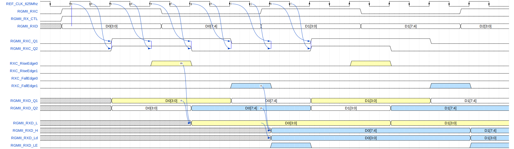

**OVER_SAMPLING** - Experimental feature.
	This feature was introduced due to rare but fatal design errors 
	that occur in process of developing the RGMII interface.
	In some PCB designs, the RGMII_RXC clock from the PHY was connected to the CLK_n clock pin of the Xilinx FPGA,
	which cannot be used as a clock input in LVCMOS mode.
	If OVER_SAMPLING = "YES," the RGMII_RXC signal from the PHY is used not as a clock, but as another data line.
	The clock is an internal 625 MHz signal, received from the PLL inside the FPGA.
	The 625 MHz clock is completely asynchronous to the RGMII_RXC clock.
	The optimal eye diagram position is determined by the RGMII_RXC signal's edge positions.
	Received data is fed into an Elastic FIFO, from which the data stream can be read by a local clock.

Valid values:
*      "YES" or "NO"

This feature was tested with Xilinx Spartan 7 and Artix 7 Devices with speed grade of -2. The solution posibly works at a resampling frequency below 625 MHz,
but it has not yet been tested.

